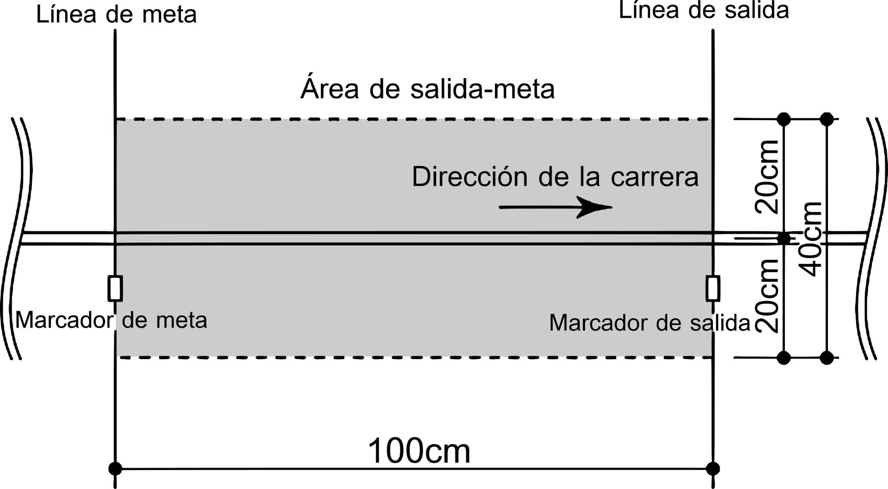

# Beauchef Robotic Challenge 
 

## Notas

### Acerca de 

* Este es el libro oficial de reglas de la competencia de robótica Beauchef Robotic Challenge (BRC).
* Basado en la categoría *Robotrace* del torneo *All Japan Micromouse Contest* y en la categoría *Velocidad* de la *Competencia Robótica UTFSM*.
* Cualquier consulta, enviar un mail a: <beauchefrc@gmail.com>

### Agradecimientos

Queremos agradecer a los miembros de la Comunidad de Robótica, Fablab y IEEE UChile por adaptar las reglas y organizar la BRC.

También queremos agradecer a las siguientes instituciones por su colaboración en la realización de BRC:

* **Facultad de Ingeniería y Ciencias** (FCFM) de la Universidad de Chile por el apoyo entregado para la realización de esta competencia. 
* **Innovación y Robótica Estudiantil** de la Universidad Técnica Federíco Santa María (UTFSM) por su invaluable apoyo en la creación de este libro y organización de BRC.

### Changelog

* **Agosto 2018**
  * Recopilación de las reglas de BRC'18 para la creación de este libro de reglas.

## Reglas

### Objetivo de la Competencia

El objetivo de la competencia es recorrer un circuito en el menor tiempo posible utilizando un robot seguidor de líneas autónomo. Un robot que participa en esta competencia se denomina Robotracer. Un ejemplo del formato de la competencia se puede ver en el siguiente video: ​<https://www.youtube.com/watch?v=960e5Q_PhWg>

### Reglas del Robotracer
1. El Robotracer debe ser autónomo. Exceptuando la zona de partida, los competidores tiene prohibido controlar el robot de forma alámbrica o inalámbrica.

2. Los competidores tienen prohibido añadir, remover, reemplazar o modificar el hardware o el software del Robotracer durante la ronda. Sin embargo, se permiten pequeñas reparaciones mecánicas como ajustar piezas que se suelten.

3. El tamaño del Robotracer no puede exceder un largo de 25 [cm], ancho de 25 [cm] y alto de 25 [cm].

4. El Robotracer no puede estar equipado con ningún mecanismo de sujeción que pudiera aumentar su agarre y/o dañar el escenario, tales como: quíımicos adherentes, púas en las ruedas, entre otros.

### Reglas del Escenario

1. La superficie del escenario está hecha de tableros de MDF negro (Ver Figura 1). Las líneas del recorrido están hechas con cinta blanca de 19 [mm] de ancho. El largo máximo del recorrido es de 60 [m].

2. El recorrido está compuesto de segmentos rectos y arcos y las líneas se pueden cruzar.

3. El recorrido de la pista será secreto hasta iniciar la competencia. Los organizadores pueden cambiar la forma de la pista sin previo aviso. Todos los Robotracer competirán en la misma pista con la misma forma.
 El objetivo de la competencia es recorrer un circuito en el menor tiempo posible utilizando un robot seguidor de líneas autónomo. Un robot que participa en esta competencia se denomina Robotracer. Un ejemplo del formato de la competencia se puede ver en el siguiente video: ​<https://www.youtube.com/watch?v=960e5Q_PhWg>
 
4. El radio mínimo del arco de curvatura es de 10 [cm]. La distancia al punto de cambio de curvatura es sobre 10 \[cm] (Ver Figura 2).

5. Cuando las líneas se cruzan, el ángulo de la intersección es de 90&deg;±5&deg; (Ver Figura 3). Antes y después de la intersección hay 25 [cm] de línea recta.

6. La línea de salida y de meta estarán en una sección recta. La línea de meta estará dispuesta 1 [m] antes de la línea de salida. Los marcadores de salida y meta estarán situados al costado derecho de la línea del recorrido (Ver detalles en las Figuras 4 y 5).

7. Se denominará área de Salida-Meta la zona comprendida a 20 [cm] a la derecha e izquierda entre la línea de salida y la de meta (Ver Figura 4). En la línea de salida y de meta estarán situados el Portal de Salida y el Portal de Meta respectivamente. El ancho del portal es de 40 [cm] y su altura es de 25 [cm] (Ver Figura 6).

8. Antes y después de las líneas de meta y salida hay al menos 25 [cm] de línea recta.

9. Donde hay cambios de curvatura hay marcadores de esquina al costado izquierdo de la línea del recorrido (Ver Figura 2).

10. La superficie del escenario será plana. Pudiendo existir desniveles de 5 [mm] entre las planchas de madera.

11. En algunos casos, los arcos de curvatura aparecen continuamente (Ver Figura 2).

12. El escenario está construido con una precisión humana. Por lo tanto, pueden existir desniveles de 5 [mm] a los sumo. No se aceptaran reclamos sobre el agarre de la superficie.

13. La posición del sensor de salida y de meta se muestran en la Figura 6. Estos son de tipo infrarrojo y se encuentran a 1 [cm] por sobre el suelo.

### Reglas de la Competencia

1. La proyección del Robotracer con respecto al escenario debe cubrir la línea del trayecto durante la carrera. Si el Robotracer se sale completamente se considerará como vuelta inválida.

2. Cada competidor tiene 9 minutos para un máximo de 3 intentos, incluidos en este tiempo las reparaciones y vueltas completadas.

3. Para cada intento, el Robotracer debe comenzar desde el área de Salida-Meta en la dirección especificada.

4. Al terminar el recorrido, el Robotracer debe detenerse automáticamente en el área de Salida-Meta por al menos 2 segundos, de lo contrario la vuelta será considerada como inválida.

5. La vuelta más rápida será registrada como el tiempo oficial.

6. El tiempo de vuelta se considera desde que el sensor de salida detecta el Robotracer y termina cuando el sensor de meta lo detecte. Además, el cuerpo entero del Robotracer debe estar dentro del área de Salida-Meta, en caso contrario el tiempo no será medido.

7. Si el Robotracer se apaga o se queda detenido por más de 2 segundos mientras compite, se considerará como vuelta inválida.

8. Si el Robotracer está en medio de un intento y se acaban los 9 minutos, se considerará como vuelta inválida.

9. Las condiciones lumínicas, de temperatura y de humedad serán las dadas por el ambiente. Peticiones para ajustarlas no serán aceptadas.

10. Después de dar como iniciada una vuelta, si el Robotracer no puede pasar de la línea de inicio, igualmente será considerada como una vuelta.

11. Sólo dentro del tiempo reglamentario los competidores tienen permitido calibrar los sensores exclusivamente dentro del área de meta.

12. Luego de que el recorrido sea revelado al público, el competidor tiene prohibido agregar información específica sobre éste al Robotracer.

13. El competidor tiene prohibido tocar el Robotracer una vez iniciada la vuelta, a menos que sea solicitado o permitido por un juez de la competencia.

14. El juez de la competencia tiene permiso para preguntar al competidor sobre su Robotracer si es necesario.

15. Una ronda consiste en el paso de todos los Robotracer por la pista. Dependiendo del número de competidores, se harán diferentes rondas de eliminación.

16. El equipo que logre el tiempo más rápido en la última ronda, será el ganador

### Reglas de los Competidores

1. Los competidores pueden participar en equipos de hasta 4 personas.

2. El competidor tiene permitido limpiar el polvo y la suciedad de las ruedas del Robotracer usando cinta adhesiva o similar. Sin embargo no está permitido utilizar un disolvente o similar con el propósito de incrementar la fricción.
 
3. Los competidores tienen prohibido cargar programas o reemplazar la memoria ROM durante la ronda. Tampoco esta permitido enviar cualquier tipo de información al Robotracer desde una unidad de desarrollo o consola terminal que sea independiente de la unidad Robotracer.

4. Los competidores tienen prohibido tocar el Robotracer durante la ronda a menos que tengan autorización de un juez.

5. Se permiten competidores de cualquier departamento de la FCFM. Sin embargo, estos deben pertenecer a pregrado (los alumnos de postgrado no pueden participar. Sin embargo, se pueden hacer excepciones para alumnos que realicen doble titulación con Magíster. Para ello, deben pedir autorización a nuestro correo: <beauchefrc@gmail.com>

## Recursos
### Figuras
<link rel="stylesheet" type="text/css" media="all" href="./css/image.css" />
<figure class="center">
	
	<figcaption>Figure 1: Pista Referencial</figcaption>
</figure>

<figure class="center">
	
	<figcaption>Figure 2: Cambios de Curvatura y Marcadores de Esquina</figcaption>
</figure>

<figure class="center">
	
	<figcaption>Figure 3: Intersección</figcaption>
</figure>

<figure class="center">
	
	<figcaption>Figure 4: Área de Salida/Meta</figcaption>
</figure>

<figure class="center">
	
	<figcaption>Figure 5: Marcador de Salida y de Meta</figcaption>
</figure>

<figure class="center">
	
	<figcaption>Figure 6: Portal de Salida/Meta</figcaption>
</figure>